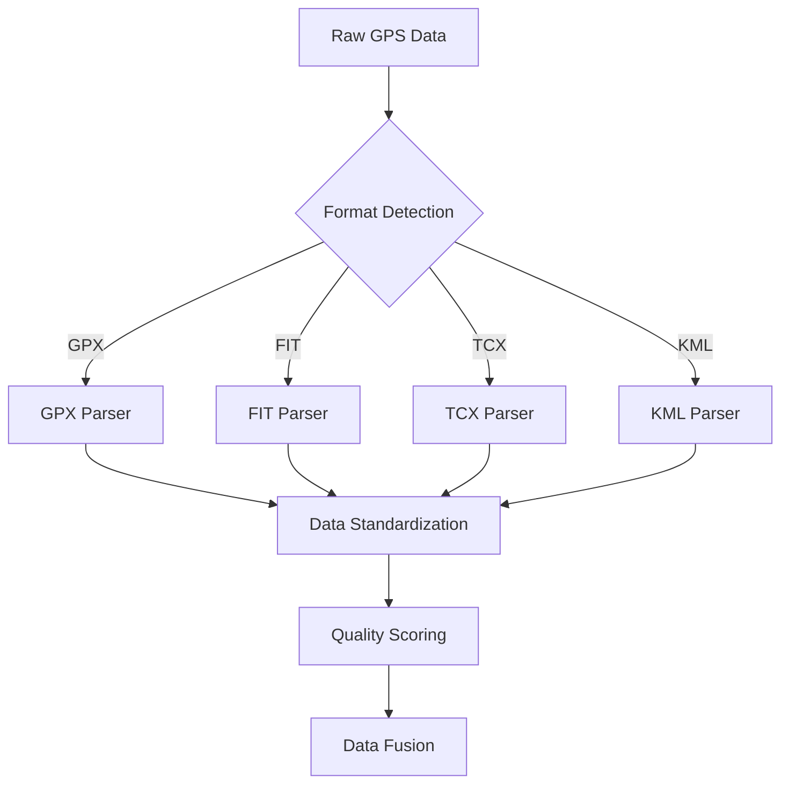
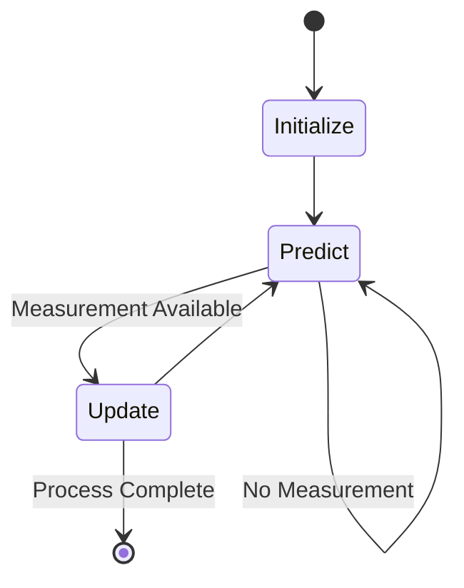
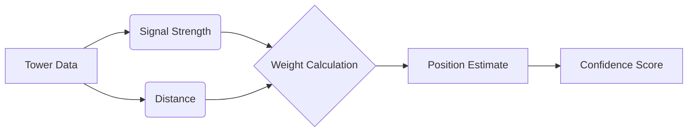

<h1 align="center">Sighthound</h1>
<p align="center"><em>" I have seen all the things that are done under the sun"</em></p>

<p align="center">
  
</p>


[](https://pypi.org/project/science-platform/)
[](https://opensource.org/licenses/MIT)

Sighthound is a python package that applies line-of-sight principles in reconstructing high resolution geolocation data from the combined output of all inter and intra vendor
activity annotation files from consumer grade and commercially available wearable activity tracking smart watches.
It fuses data from multiple sources, applies dynamic filtering, triangulates positions, calculates optimal and Dubin's paths, and provides structured JSON outputs. Built for researchers and analysts, it leverages mathematical models and geospatial techniques for accurate and meaningful results.

---

## Features and Theoretical Explanations

### 1. **Multi-Source GPS Data Fusion**

Combines GPS data from various formats (GPX, KML, TCX, FIT). Missing data points are handled using **linear interpolation**:

$$
x(t) = x_1 + \frac{t - t_1}{t_2 - t_1} \cdot (x_2 - x_1)
$$

Where:

$$t: \text{ Missing timestamp}$$

$$x(t): \text{ Interpolated value}$$

$$t_1, t_2: \text{ Known timestamps before and after } t$$

$$x_1, x_2: \text{ GPS values at } t_1, t_2$$

#### Data Source Quality Matrix

| Source Type | Temporal Resolution | Spatial Accuracy | Typical Use Case |
|-------------|-------------------|------------------|------------------|
| GPX | 1-5s | 5-10m | Outdoor Activities |
| FIT | 1s | 3-5m | Sports Training |
| TCX | 1s | 3-5m | Fitness Tracking |
| KML | Variable | 5-15m | Route Planning |



### 2. **Dynamic Kalman Filtering**

The Kalman filter smooths noisy GPS data and predicts missing points by modeling the system state:

#### Prediction Step:

$$
\begin{aligned}
x_k &= F \cdot x_{k-1} + w \\
P_k &= F \cdot P_{k-1} \cdot F^T + Q
\end{aligned}
$$

Where:

$$x_k: \text{ State vector (position, velocity)}$$

$$F: \text{ State transition matrix}$$

$$w: \text{ Process noise}$$

$$P_k: \text{ Error covariance matrix}$$

$$Q: \text{ Process noise covariance}$$

#### Update Step:

$$
\begin{aligned}
y_k &= z_k - H \cdot x_k \\
K_k &= P_k \cdot H^T \cdot (H \cdot P_k \cdot H^T + R)^{-1} \\
x_k &= x_k + K_k \cdot y_k \\
P_k &= (I - K_k \cdot H) \cdot P_k
\end{aligned}
$$

Where:

$$z_k: \text{ Measurement vector}$$

$$H: \text{ Observation matrix}$$

$$K_k: \text{ Kalman gain}$$

$$R: \text{ Measurement noise covariance}$$

#### Filter Performance Characteristics

| Scenario | Accuracy Improvement | Computational Cost |
|----------|---------------------|-------------------|
| High Noise | 40-60% | High |
| Missing Data | 20-30% | Medium |
| Regular Updates | 10-20% | Low |



### 3. **Triangulation**

Position refinement using cell tower data employs weighted triangulation:

$$
\begin{aligned}
\text{Latitude} &= \frac{\sum (\text{Latitude}_i \cdot w_i)}{\sum w_i} \\
\text{Longitude} &= \frac{\sum (\text{Longitude}_i \cdot w_i)}{\sum w_i}
\end{aligned}
$$

Where:

$$ w_i = \frac{1}{\text{Signal Strength}_i} \text{ for each tower } i$$

#### Tower Weight Distribution

| Signal Strength (dBm) | Weight Factor | Confidence Level |
|----------------------|---------------|------------------|
| > -70 | 1.0 | High |
| -70 to -85 | 0.8 | Medium-High |
| -85 to -100 | 0.5 | Medium |
| < -100 | 0.2 | Low |



### 4. **Optimal Path Calculation**

The optimal path is computed using external routing APIs (e.g., Mapbox). The shortest path algorithm leverages Dijkstra's or A*:

#### **Dijkstra's Algorithm**


$$\text{dist}[v] = \min(\text{dist}[u] + w(u, v))$$


Where:

- 
  $$( \text{dist}[v] ): Shortest distance to vertex ( v )$$.

- 
  $$( w(u, v) ): Weight of the edge from ( u ) to ( v )$$.


#### **A***:

Heuristic-enhanced version of Dijkstra:

$$
f(v) = g(v) + h(v)
$$

Where:

- 
  $$( g(v) ): Cost from start to ( v )$$.

- 
  $$( h(v) ): Heuristic estimate of cost to goal$$.
 

---

### 5. **Dubin's Path**

Dubin's path calculates the shortest path for vehicles or humans with turning constraints. It uses circular arcs and straight-line segments:

#### **Types of Dubin's Paths**

1. **Left-Straight-Left (LSL)**:
   
   $$\text{Path} = R \cdot (\theta_1 + \pi) + L + R \cdot (\theta_2 + \pi)$$
   
2. **Right-Straight-Right (RSR)**:
   
   $$\text{Path} = R \cdot (\theta_1) + L + R \cdot (\theta_2)$$
   

Where:


$$( R )$$

: Turning radius.

- 
  $( L )$: Length of the straight segment
- 
  $( \theta_1, \theta_2 )$: Angular changes 
 

---

## Installation

Clone the repository and install dependencies:

```bash
git clone https://github.com/yourusername/sighthound.git
cd sighthound
pip install -r requirements.txt
```

## Usage and Interfaces

Sighthound offers multiple interfaces for different user needs and workflows:

### Command-Line Interface

Process geolocation data directly from the terminal with comprehensive argument parsing:

```bash
# Basic usage with default parameters
sighthound process --input path/to/data.gpx --output results/

# Advanced usage with processing options
sighthound process --input path/to/data.gpx --output results/ --filter kalman --interpolate --format geojson

# Get help on available commands
sighthound --help
```

The CLI provides real-time progress indicators for long-running operations, ensuring you stay informed about processing status.

### Web Interface

For visual exploration of results, Sighthound includes a web interface:

```bash
# Start the web interface on default port (8080)
sighthound serve

# Specify a custom port
sighthound serve --port 9000
```

The web interface features:
- Interactive map visualization
- Trajectory comparison tools
- Quality metrics display
- Customizable visualization templates for common analysis scenarios

### API Integration

For integration with other systems, Sighthound provides a RESTful API:

```python
import requests

# Example API call to process a file
response = requests.post(
    'http://localhost:8080/api/process',
    files={'data': open('path/to/data.gpx', 'rb')},
    data={'filter_type': 'kalman', 'output_format': 'geojson'}
)

# Get the results
result = response.json()
```

### Dashboard

Monitor processing status through the built-in dashboard:

```bash
# Launch the dashboard
sighthound dashboard

# Access through browser at http://localhost:8081
```

The dashboard provides:
- Real-time processing status
- Resource utilization metrics
- Job queue management
- Error monitoring and alerts

### Error Handling

All interfaces provide improved error messages with context-specific guidance:

```
ERROR: Unable to parse GPX file (line 42, column 7)
  - XML validation error: Missing closing tag for <trkpt>
  - Suggestion: Check file format or try the --repair flag
```

Configuration validation provides immediate feedback on parameter errors:

```
CONFIG ERROR: Invalid parameter 'kalmen_filter'
  - Did you mean 'kalman_filter'?
  - See documentation at: https://docs.sighthound.dev/config
```

## Output Formats

The framework supports multiple output formats:
- CSV with enhanced trajectory data
- CZML for visualization in Cesium
- GeoJSON for web mapping applications
- Popular GIS formats (Shapefile, KML, GeoPackage)

Each output includes:
- Enhanced position data
- Confidence metrics
- Source attribution
- Quality scores

Export options are configurable through all interfaces:

```bash
# CLI export example
sighthound export --input processed_data.json --format shapefile --output gis_data/

# API export example
curl -X POST http://localhost:8080/api/export \
  -H "Content-Type: application/json" \
  -d '{"data": "processed_data.json", "format": "kml"}'
```

## Visualizations

Sighthound produces high-fidelity visualizations that illustrate the power of its geolocation processing capabilities.

### 3D Path Reconstruction

The following visualization demonstrates Sighthound's ability to reconstruct human movement paths with high precision through 3D modeling:

<p align="center">
  
  <br>
  <em>Initialization of 3D human movement path reconstruction</em>
</p>

<p align="center">
  
  <br>
  <em>Full 3D reconstruction of a running path with animated human model</em>
</p>

The 3D visualizations above show:
- Initial path determination based on raw GPS data
- Smoothed trajectory through Kalman filtering
- Human model accurately positioned along the optimized path
- Real-time movement simulation based on calculated velocities and accelerations

### Geospatial Data Processing

<p align="center">
  
  <br>
  <em>GPS trace visualization with triangulated position improvements</em>
</p>

Sighthound's processing pipeline creates various geospatial outputs:

- **GeoJSON:** Detailed position data with timestamps and quality metrics (`public/puchheim_triangulated_sighthound.geojson`)
- **JSON:** Processed trajectory data with multi-source fusion (`public/merged_data.json`, `public/smoothed_data.json`)
- **CZML:** Time-dynamic visualization for Cesium (`public/merged_activity.czml`, `public/activity.czml`)

The outputs can be directly loaded into GIS software, web mapping applications, or visualization tools to analyze movement patterns, optimize routes, or identify areas of interest.

## Performance Metrics

The system's performance is evaluated using:

1. **Position Accuracy:**
   ```math
   RMSE = \sqrt{\frac{1}{n}\sum_{i=1}^{n} (p_{true} - p_{est})^2}
   ```

2. **Confidence Correlation:**
   ```math
   r = \frac{\sum (C - \bar{C})(E - \bar{E})}{\sqrt{\sum(C - \bar{C})^2 \sum(E - \bar{E})^2}}
   ```
   Where C is confidence and E is error.

## Documentation

Comprehensive documentation is available:

- **User Guide**: Step-by-step instructions for common workflows
- **API Reference**: Complete documentation of all public interfaces
- **Configuration Guide**: Detailed explanation of all configuration options
- **Troubleshooting Guide**: Solutions for common issues

Access documentation through:
```bash
# Open documentation in browser
sighthound docs

# Get specific help
sighthound docs --topic configuration
```

## Future Work

- Implementation of machine learning-based confidence scoring
- Support for additional data sources
- Real-time processing capabilities
- Enhanced error modeling and propagation

## References

[1] Bähr, S., Haas, G. C., Keusch, F., Kreuter, F., & Trappmann, M. (2022). Missing Data and Other Measurement Quality Issues in Mobile Geolocation Sensor Data. *Survey Research Methods*, 16(1), 63-74. https://doi.org/10.18148/srm/2022.v16i1.7497

[2] Beauchamp, M. K., Kirkwood, R. N., Cooper, C., Brown, M., Newbold, K. B., & Scott, D. M. (2019). Monitoring mobility in older adults using global positioning system (GPS) watches and accelerometers: A feasibility study. *Journal of Aging and Physical Activity*, 27(2), 244-252. https://doi.org/10.1123/japa.2017-0311

[3] Labbe, R. (2015). Kalman and Bayesian Filters in Python. GitHub repository: FilterPy. Retrieved from https://github.com/rlabbe/filterpy

These references support key components of SightHound:
- [1] addresses challenges in mobile geolocation data quality and missing data handling
- [2] validates GPS data fusion methodologies in real-world applications
- [3] provides theoretical foundation for the Kalman filtering implementations

## License

MIT License - see LICENSE file for details
